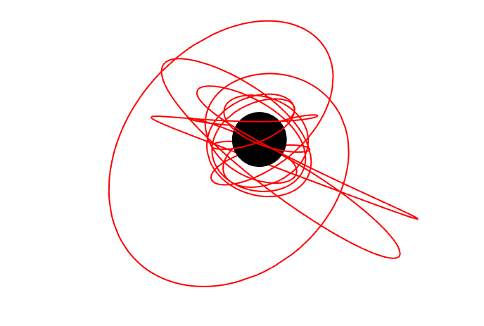



<p align="center"></p>

The KerrGeodesics package for Mathematica provides functions for computing bound timelike geodesics and their properties in Kerr spacetime.

## Example usage

As a quick example, the figure at the top of this page is made using the simple commands:
```
orbit = KerrGeoOrbit[0.998, 3, 0.6, Cos[π/4]];
{t, r, θ, φ} = orbit["Trajectory"];
```
Followed by the plot command:
```
Show[
 ParametricPlot3D[{r[λ] Sin[θ[λ]] Cos[φ[λ]], r[λ] Sin[θ[λ]] Sin[φ[λ]], r[λ] Cos[θ[λ]]}, {λ, 0, 20}, 
  ImageSize -> 700, Boxed -> False, Axes -> False, PlotStyle -> Red, PlotRange -> All],
 Graphics3D[{Black, Sphere[{0, 0, 0}, 1 + Sqrt[1 - 0.998^2]]}]
 ]
```

## Orbital parametrization

The orbits are parameterized by the following

$a$ - the black hole spin  
$p$ - the semi-latus rectum  
$e$ - the eccentricity  
$x_\text{inc} = \cos\theta_\text{inc}$ - the orbital inclination.  

The parametrization $\\{a,p,e,\theta_\text{inc}\\}$ is described in, e.g., Sec. II of [arXiv:gr-qc/0509101](https://arxiv.org/abs/gr-qc/0509101)

## Getting the package

The latest development version will always be available from the project git
repository:

```bash
git clone https://github.com/BlackHolePerturbationToolkit/KerrGeodesics.git
```

## Requirements


The KerrGeodesics package requires a recent version of Mathematica. It is typically
tested with only the latest available version.

## Installation

Clone the repository and place it somewhere on Mathematica's $Path.
Typical locations are inside \${HOME}/.Mathematica/Applications/ for Linux or
inside \${HOME}/Library/Mathematica/Applications/ for Mac OSX.

## Usage

The package may be loaded into Mathematica using the command:

```Mathematica
<< KerrGeodesics`
```


## Documentation and examples

Examples are included in the documentation. See the
KerrGeodesics page in Documentation Center. The package includes functions to calculate, e.g.,

* Constants of motion and orbital frequencies
* The orbital trajectory and 4-velocity
* The location of the photon sphere
* The location of inner-most bound and inner-most stable circular/spherical orbits
* The location of the separatrix between bound and plunging orbits

## Changelog

22 November 2018: Merged the development branch into the master branch. Thanks to Zach, Tommy and Chuck for contributing code. This update is a major change with a lot of improvements. A key difference is the defintion of the inclination angle which is now x_inc = Cos[\theta_inc]. Bumped version number up to 0.5.<br/>
7 August 2018: Added generic orbit calculation (thanks for M. van de Meent for contributing code). Currently the code is separated in KerrGeoOrbit2[..] but will soon replace the earlier code.<br>
7 September 2017: Initial version publicly released.<br>
10 June 2017: Initial version created.

## Known problems

Known bugs are recorded in the project [bug tracker](https://github.com/BlackHolePerturbationToolkit/KerrGeodesics/issues).

## License

This code is distributed under the University of Illinois/NCSA
Open Source License. Details can be found in the LICENSE file.


## Authors

Niels Warburton, Maarten van de Meent, Zach Nasipak, Thomas Osburn, Charles Evans