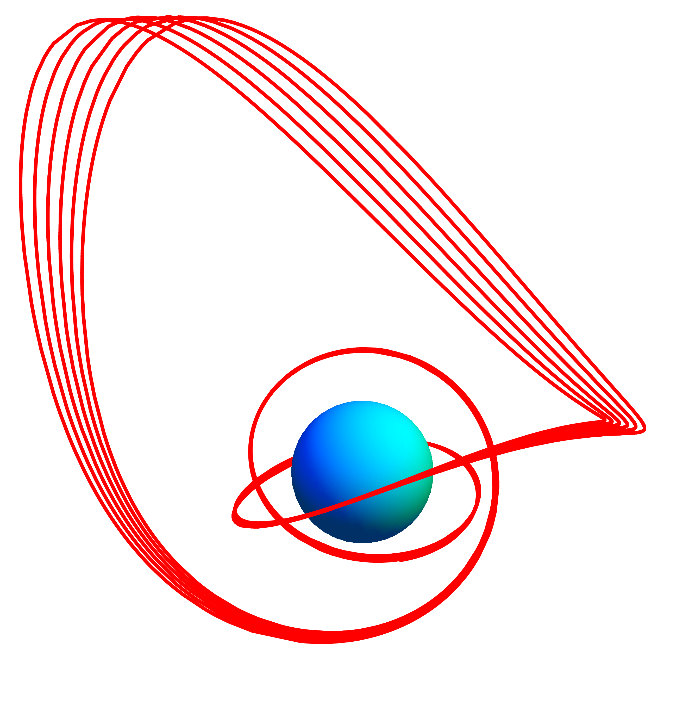

The KerrGeodesics package for Mathematica provides functions for computing bound timelike geodesics and their properties in Kerr spacetime.

## Getting the package

The latest development version will always be available from the project git
repository:

```bash
git clone https://github.com/BlackHolePerturbationToolkit/KerrGeodesics.git
```

## Requirements


The KerrGeodesics package requires a recent version of Mathematica. It is typically
tested with only the latest available version.

## Installation

Clone the repository and place it somewhere on Mathematica's $Path.
Typical locations are inside ${HOME}/.Mathematica/Applications/ for Linux or
inside ${HOME}/Library/Mathematica/Applications/ for Mac OSX.


## Usage

The package may be loaded into Mathematica using the command:

```Mathematica
<< KerrGeodesics`
```


## Examples

Examples are included in the documentation. See the
KerrGeodesics page in Documentation Center.

## Changelog

7 September 2017: Initial version publicly released<br>
10 June 2017: Initial version created.

## Known problems

Known bugs are recorded in the project [bug tracker](https://github.com/BlackHolePerturbationToolkit/KerrGeodesics/issues).

## License

This code is distributed under the University of Illinois/NCSA
Open Source License. Details can be found in the LICENSE file.


## Authors

Niels Warburton  